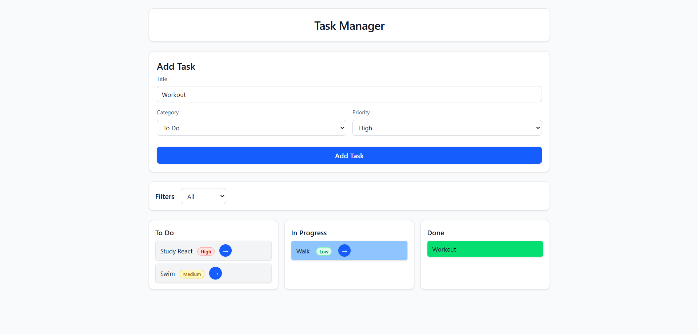

# Task Manager (React)

A simple task manager built in React. Tasks can be added with a title and priority, moved through stages (Todo → In Progress → Done), and filtered by priority.



## Features
- Add tasks
- Priority: High / Medium / Low
- Stages: Todo → In Progress → Done
- Filter by priority
- Built with React + Tailwind

## Tech Stack
- React (useState)
- Vite
- Tailwind CSS

## Run Locally

```bash
npm install
npm run dev
